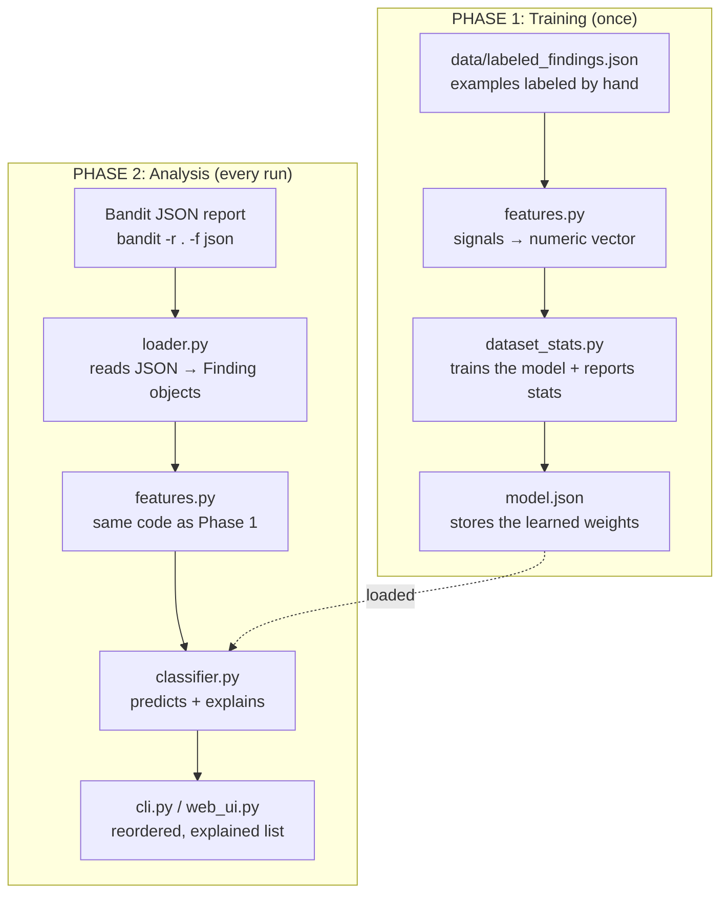
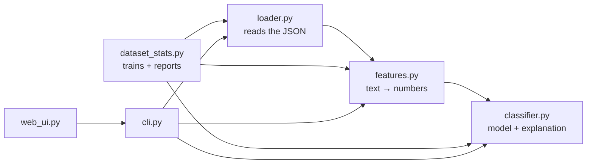

# Architecture of bandit-triage

How the project is put together and how data moves through it.

## The two phases

Training happens once and produces the model file. Analysis runs every time you
triage a report. `features.py` is used in both, which matters: if training and
analysis turned data into numbers differently, the model would be fed input it
never learned on.



## How the files depend on each other



## The files

* **`loader.py`** reads a JSON file, from Bandit or from the training data, and
  turns each finding into a tidy `Finding` object with fields like `filename`,
  `code`, `test_id`, `issue_severity`, and `cwe_id`. Nothing clever. It just
  makes the data easy for everything else to use.
* **`features.py`** is the conceptual core. A model can't read "this is a test
  file", only numbers, so this file converts each `Finding` into numeric
  signals. Every one of them is a clue a reviewer would check by hand.
* **`classifier.py`** is a logistic regression. Each feature carries a weight,
  the model sums weight times value, and squashes the result into a probability
  between 0 and 1. Because it's just a weighted sum, it can also report which
  feature drove any given prediction. That's the explanation.
* **`dataset_stats.py`** runs the labeled examples through `features.py`,
  fits the weights, and saves `model.json`. It also writes `dataset_stats.md`
  (counts and accuracy per rule) and `misclassified.md` (findings where the
  model disagrees with the label). Run it after any dataset change.
* **`cli.py`** and **`web_ui.py`** are the two interfaces, terminal and
  browser. Both import the same logic, so they always agree.

## Which rules the model handles well

`features.py` defines a fixed list of known rule IDs:

```python
KNOWN_TEST_IDS = ["B105", "B101", "B602", "B301", "B608", "B614", "B615"]
```

This does not mean other rules are rejected. Every finding gets a prediction.
What changes is how much the model knows:

* **Rule in the list:** the model uses all its signals, including a dedicated
  flag for that specific rule. Its judgment is fully informed.
* **Rule not in the list:** all rule flags stay at zero, so it falls back to
  generic context signals only. It still answers, but without knowing what kind
  of issue it's looking at, so trust it less.

The real limit isn't the list, it's the dataset. Adding a rule ID to
`KNOWN_TEST_IDS` without adding labeled examples achieves nothing: the new flag
would be zero across all training data, so the model learns nothing from it.

To add a rule such as B303:

1. Collect labeled examples of it and add them to `data/labeled_findings.json`.
2. Add the ID to `KNOWN_TEST_IDS` in `features.py`.
3. Retrain with `python3 dataset_stats.py`.

## Why these features

Every feature had to be explainable in plain words. That constraint is what
keeps the whole model explainable instead of a black box, and each one maps to
a question a reviewer already asks: where is it, what is the value, what does
the code do with it.

* **`confidence`, `severity`** are Bandit's own judgment. Useful as input even
  though the point of this project is that they shouldn't be taken at face
  value; the model learns how much to trust them. For some rules (B105 above
  all) they're effectively constant, which is exactly why the rest matter.
* **`is_test_file`** answers "where is it". A finding in a test file is almost
  always noise. This dominates B101, where an `assert` in a test is fine and
  the same `assert` in production code isn't.
* **`has_dummy_keyword`** answers "what is the value". Words like `changeme`,
  `test`, or `fake` suggest a placeholder. It also fires on empty or null
  values (`None`, `null`, `""`), since a config default like `SECRET_KEY: None`
  has the shape of a secret but holds nothing. That check matches whole values
  only, so it won't trip on a real secret that happens to contain "none".
* **`has_tainted_input`** answers "does outside data reach this", and it's the
  strongest danger signal in the set. `shell=True` fed by user input is
  exploitable and `pickle.loads` on attacker controlled bytes is remote code
  execution, while the same calls on fixed internal data are not. It covers web,
  CLI, and environment input (`request.`, `input(`, `sys.argv`, form and query
  params) plus cache stores (`redis`, `memcache`), raw sockets (`socket.`,
  `.recv(`), and message queues (`kafka`, `pika.`, `.consume(`). The patterns
  stay narrow to avoid matching ordinary internal calls.
* **`has_dynamic_concat`** flags a string built at runtime, an injection risk,
  versus a fixed literal.
* **`secret_score`** is a gradual score from 0 to 1 for how much a flagged
  value resembles a real secret. It averages two simple signals: length, since
  real secrets tend to be long, and character variety, since real secrets mix
  cases, digits, and symbols while placeholders like `blerg` use one kind. It
  exists because B105's other signals are so weak, and the model needed some
  way to separate `password = "blerg"` from
  `my_secret = "d6s$f9g!j8mg7hw?n&2"`. It's deliberately imperfect: a long
  placeholder like `"this cool password"` still scores high. A dictionary word
  check would be the obvious next improvement.
* **`rule_Bxxx`** tells the model what kind of issue it is.

## The weights are learned, not set by hand

A common misreading is that we assign each feature's importance ourselves,
deciding that "test file" is worth -0.8. We don't. Training in
`dataset_stats.py` works out the weights from the labeled data:

1. Start from essentially arbitrary weights.
2. Predict on a labeled example.
3. Compare to the true label and, when wrong, nudge the weights toward what
   would have been right.
4. Repeat across every example, many times over.

So the final weights reflect what is actually true in the labeled examples, not
our opinion. That's why label quality matters so much, and why the dataset
rather than the code is what really determines how good the tool is.

Because this is plain logistic regression, the learned weights can also be read
back out to see what the model concluded. That readout is exactly what produces
the explanation attached to each finding.
