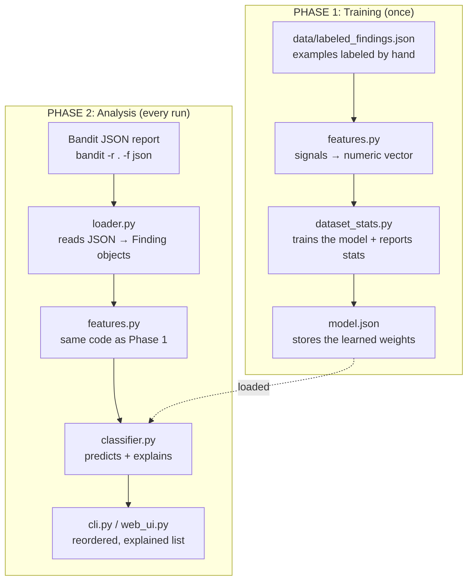

# Architecture of bandit-triage

How the project is put together and how data moves through it.

## The two phases

Training happens once and produces the model file. Analysis runs every time you
triage a report. `features.py` is used in both: if the two turned data into
numbers differently, the model would be fed input it never learned on.



## The files

* **`loader.py`** reads a JSON file (from Bandit or the training data) and turns
  each finding into a tidy `Finding` object (`filename`, `code`, `test_id`,
  `issue_severity`, `cwe_id`, ...).
* **`features.py`** is the conceptual core: it converts each `Finding` into
  numeric signals, each one a clue a reviewer would check by hand.
* **`classifier.py`** is logistic regression. Each feature carries a weight; the
  model sums weight times value and squashes it to a probability. Because it's a
  weighted sum, it can also report which feature drove a prediction, which is
  the explanation.
* **`dataset_stats.py`** runs the labeled examples through `features.py`, fits
  the weights, saves `model.json`, and writes `dataset_stats.md` and
  `misclassified.md`. Run it after any dataset change.
* **`cli.py`** and **`web_ui.py`** are the terminal and browser interfaces; both
  import the same logic, so they always agree.

## Which rules the model handles well

`features.py` defines a fixed list of known rule IDs:

```python
KNOWN_TEST_IDS = ["B101", "B105", "B608"]
```

Every finding still gets a prediction; the list only changes how much the model
knows. A rule in the list gets a dedicated flag and a fully informed judgment; a
rule not in the list falls back to generic context signals only, so trust it
less.

The three active rules cover both shapes of finding. B101 (`assert`) and B105
(hardcoded password) are decided by a static signal (`is_test_file`,
`secret_score`) because origin doesn't matter. B608 (string-built SQL) is an
injection rule where origin is everything, and is what the data-flow work
targets. Other flow rules (B301, B602, B614, B615) are archived under
`data/archive/` until the engine covers them.

The real limit is the dataset, not the list: adding an ID without adding labeled
examples achieves nothing. To add a rule: collect labeled examples into
`data/labeled_findings.json`, add the ID to `KNOWN_TEST_IDS`, and retrain with
`dataset_stats.py`.

## The features

Every feature is explainable in plain words, which is what keeps the model a
white box. Each maps to a question a reviewer asks: where is it, what is the
value, what does the code do with it.

* **`confidence`, `severity`**: Bandit's own judgment, hardcoded per rule rather
  than computed per finding (see the README), so the model learns how much to
  trust them rather than taking them at face value.
* **`is_test_file`** ("where is it"): a finding in a test file is usually noise.
  Dominates B101. It reads a file for a `TestCase` class (content) or accepts a
  `tests/` directory or `test_*.py` name (path), telling real tests apart from
  production packages like Django's `django/test/` that merely contain "test".
* **`has_dummy_keyword`** ("what is the value"): words like `changeme` or `fake`
  suggest a placeholder; also fires on empty/null values (`SECRET_KEY: None`).
* **`has_tainted_input`** ("does outside data reach this"): the strongest danger
  signal. For B608 it comes from the taint engine, tracing each value back to
  its origin; other rules use a regex over the snippet (`request.`, `input(`,
  `sys.argv`, cache stores, sockets, queues).
* **`has_sanitizer`** ("was it cleaned"): set by the engine when a sanitizer
  (parameterization, escaping, quoting) sits between source and sink.
* **`has_dynamic_concat`**: a string built at runtime versus a fixed literal.
* **`secret_score`**: a 0-to-1 score of how much a value resembles a real secret,
  averaging length and character variety. It separates `password = "blerg"` from
  `my_secret = "d6s$f9g!j8mg7hw?n&2"`. Deliberately imperfect; a dictionary-word
  check would be the next improvement.
* **`rule_Bxxx`**: which rule fired.

## The weights are learned, not set by hand

We don't assign each feature's importance. Training in `dataset_stats.py` works
the weights out from the labeled data: start from arbitrary weights, predict on
an example, and when wrong nudge the weights toward what would have been right,
repeated across every example many times. So the weights reflect what's true in
the labels, not our opinion, which is why label quality matters more than the
code. And because it's plain logistic regression, those weights can be read back
out, which is what produces the per-finding explanation.