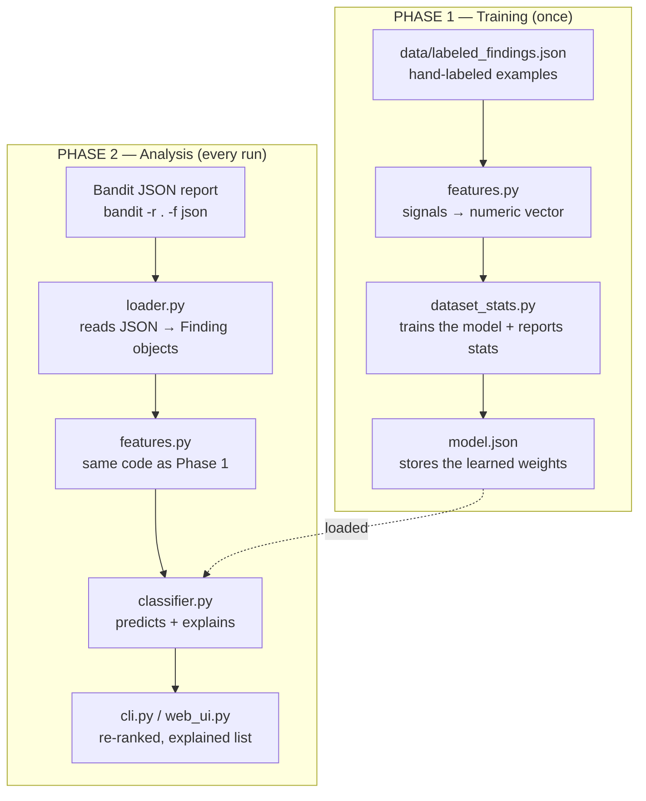
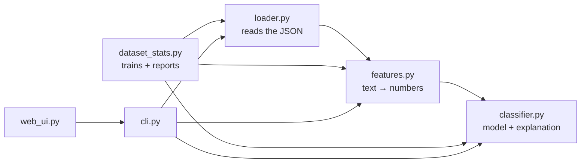

# Architecture of bandit-triage

This document explains how the project is structured and how data flows
through it.

## Data flow (the two phases)

The tool works in two phases. **Training** happens once and produces the
model file. **Analysis** runs every time you want to triage a Bandit report.
Note that `features.py` is used in *both* phases — it is essential that
training and analysis turn data into numbers in exactly the same way,
otherwise the model would receive inconsistent input.



## How the files depend on each other



## The files, one by one

- **`loader.py`** — reads a JSON file (from Bandit or from the training
  data) and turns each finding into a tidy `Finding` object with fields like
  `filename`, `code`, `test_id`, `issue_severity`, and `cwe_id`. It does
  nothing clever — it just makes the data easy for the other files to work
  with.
- **`features.py`** — the conceptual core. An ML model can't read "this is a
  test file" — only numbers. This file turns each `Finding` into a list of
  numeric signals: is Bandit's own confidence/severity high or low? Does the
  file path look like a test file? Does the flagged code contain a
  placeholder-like word? Does tainted external input appear nearby? Does the
  flagged value look like a real secret? Which Bandit rule fired? Every
  number is a clue a human reviewer would actually look for by hand.
- **`classifier.py`** — a small logistic regression model. Each feature gets
  an importance weight; the model adds them up (weighted) and produces a
  probability between 0 and 1 ("how likely is this a real issue?"). Because
  it's just "weight × value" summed, it can also report *which* feature
  drove a given prediction — that's the explanation.
- **`dataset_stats.py`** — takes all the labeled examples, runs them
  through `features.py`, and adjusts the weights until the model's guesses
  match the known labels, saving the result to `model.json`. It also writes
  two Markdown reports: `dataset_stats.md` (per-rule true/false counts,
  training-set accuracy, and a balance hint) and `misclassified.md` (the
  findings where the model disagrees with the hand label). It's the single
  command you run after changing the dataset.
- **`cli.py`** and **`web_ui.py`** — the two interfaces. They do the same
  thing (load a report, triage it, show the re-ranked and explained
  results), one from the terminal and one in the browser. Both import the
  same logic, so they always agree.

## Which rules the model actually handles well

`features.py` defines a fixed list of known rule IDs:

```python
KNOWN_TEST_IDS = ["B105", "B101", "B602", "B301", "B608", "B614", "B615"]
```

This does **not** mean the model refuses other rules. Any finding is
processed and gets a prediction. The difference is *how much* the model
knows about it:

- **A finding whose rule is in the list** — the model uses all its signals,
  including a dedicated "which rule is this" feature (a one-hot flag). Its
  judgment is fully informed.
- **A finding whose rule is NOT in the list** — all the rule flags stay at
  zero, so the model falls back to the generic context signals only (is
  it a test file? placeholder-like value? tainted input nearby? etc.). It
  still returns a prediction, but a less informed, less reliable one for that
  rule type, because it has no idea *what kind* of issue it is.

The real limit isn't this list — it's the **dataset**. The model can only
learn to judge rule types it has seen labeled examples of. Adding a rule ID
to `KNOWN_TEST_IDS` without also adding labeled examples of that rule to
`data/labeled_findings.json` does nothing useful: the new flag would always
be zero across the training data, so the model would learn nothing from it.

To extend the model to a new rule (e.g. B303), the order is:

1. Collect labeled examples of that rule (run Bandit, apply the labeling
   policy) and add them to `data/labeled_findings.json`.
2. Add the rule ID to `KNOWN_TEST_IDS` in `features.py`.
3. Retrain with `python3 dataset_stats.py`.

## Why these features were chosen

Each feature in `features.py` was picked because it captures a signal a human
reviewer actually looks at when deciding whether a finding is real or noise —
the same "three questions" the labeling policy uses (where is it? what's the
value? what does the code do with it?). The goal was that every feature be
explainable in plain words, which is what makes the whole model explainable
rather than a black box.

- **`confidence` and `severity`** — Bandit's own judgment. Worth giving to
  the model as input, even though (as the project shows) they shouldn't be
  taken at face value. The model learns *how much* to trust them. Note that
  for some rules (notably B105) these are effectively constant, so they carry
  no distinguishing information for those rules — which is exactly why the
  other features matter.
- **`is_test_file`** — captures "where is it?". A finding in a test file is
  almost always noise. This is the dominant signal for B101 (`assert`
  usage): an assert in a test is fine, an assert in production code is not.
- **`has_dummy_keyword`** — captures "what's the value?". Words like
  `changeme`, `test`, or `fake` suggest a placeholder, not a real secret. It
  also fires when the flagged value is itself empty or null (`None`, `null`,
  `""`): a config default like `SECRET_KEY: None` has the shape of a secret
  (suspicious name, production code) but no actual value, so it should not be
  treated as a real credential. The empty-value check matches whole values
  only, so it won't fire on real secrets that merely contain "none".
- **`has_tainted_input`** — captures "does data from outside the program's
  control reach this?". This is the strongest signal of real danger: a
  `shell=True` call fed by user input is exploitable, and a `pickle.loads` on
  attacker-controlled bytes is remote code execution, while the same calls on
  fixed, internal data are not. It recognizes web/CLI/environment input
  (`request.`, `input(`, `sys.argv`, form and query params) as well as other
  external sources: cache stores (`redis`, `memcache`), raw network sockets
  (`socket.`, `.recv(`), and message queues (`kafka`, `pika.`, `.consume(`).
  Patterns are kept specific to avoid false matches on common internal calls.
- **`has_dynamic_concat`** — captures whether a string is built dynamically
  (injection risk) versus a fixed literal.
- **`secret_score`** — a gradual 0..1 score of how much the flagged value
  looks like a real secret rather than a placeholder. It combines two simple,
  explainable signals (averaged): the value's length (real secrets tend to be
  long) and its character variety (real secrets mix lowercase, uppercase,
  digits, and symbols, while placeholders like `blerg` use just one kind).
  This was added specifically because for B105 findings the other signals are
  weak: Bandit's severity/confidence are effectively constant for that rule,
  so the model needed a way to tell `password = "blerg"` (placeholder) from
  `my_secret = "d6s$f9g!j8mg7hw?n&2"` (looks real). It's intentionally
  imperfect — a long placeholder like `"this cool password"` can still score
  high — but it gives the model a useful clue it didn't have before. A future
  version could add a dictionary-word check (real words like `secret` or
  `password` are likely placeholders).
- **`rule_Bxxx`** — tells the model *what kind* of issue it is.

The guiding rule: a feature earns its place only if it corresponds to
something a reviewer could point at and explain. Opaque, hard-to-explain
signals were deliberately avoided.

## Where the weights come from (they are learned, not hand-set)

A common misconception is that we assign the importance of each feature by
hand — deciding, say, that "test file" counts for -0.8. We do **not**. The
weights are **learned by the model from the labeled data** during training.

The training process (in `dataset_stats.py`), simplified:

1. The model starts with essentially arbitrary weights.
2. It looks at a labeled example (a finding plus its true/false label).
3. It makes a prediction with its current weights.
4. It compares the prediction to the true label; if it was wrong, it nudges
   the weights slightly in the direction that would have been correct.
5. It repeats across all examples, many times, until its predictions match
   the labels as closely as possible.

So the final weights reflect **what is actually true in the labeled
examples**, not our opinion. This is exactly why the quality of the labels
matters so much: label well, and the model learns sensible weights; label
carelessly, and it learns nonsense. It's also why the dataset — not the code
— is the real driver of how good the tool is.

Because this is a simple logistic regression, we can also *read* the learned
weights back out and see what the model concluded — which is precisely what
the explanation feature does when it reports, for a given finding, which
signals pushed it toward "real" or "noise".