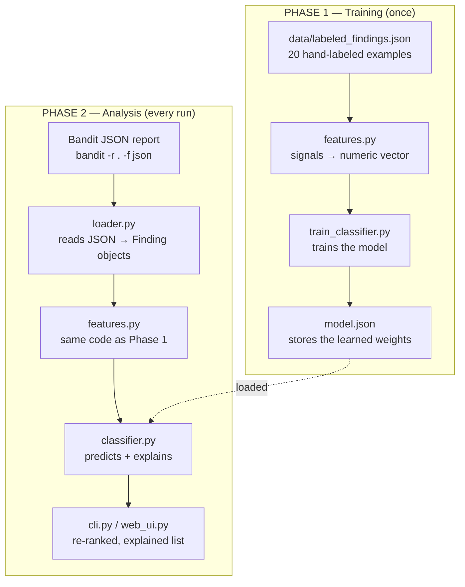
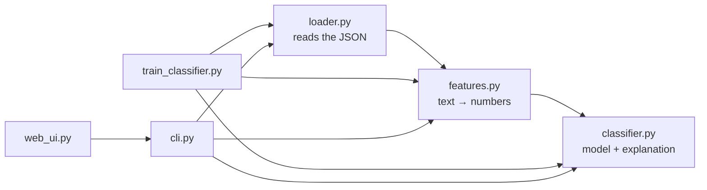

# Architecture of bandit-triage

This document explains how the project is structured and how data flows
through it.

## Data flow (the two phases)

The tool works in two phases. **Training** happens once and produces the
model file. **Analysis** runs every time you want to triage a Bandit report.
Note that `features.py` is used in *both* phases — it is essential that
training and analysis turn data into numbers in exactly the same way,
otherwise the model would receive inconsistent input.



## How the files depend on each other



## The files, one by one

- **`loader.py`** — reads a JSON file (from Bandit or from the training
  data) and turns each finding into a tidy `Finding` object with fields like
  `filename`, `code`, `test_id`, `issue_severity`, and `cwe_id`. It does
  nothing clever — it just makes the data easy for the other files to work
  with.
- **`features.py`** — the conceptual core. An ML model can't read "this is a
  test file" — only numbers. This file turns each `Finding` into a list of
  numeric signals: is Bandit's own confidence/severity high or low? Does the
  file path look like a test file? Does the flagged code contain a
  placeholder-like word? Does tainted external input appear nearby? Which
  Bandit rule fired? Every number is a clue a human reviewer would actually
  look for by hand.
- **`classifier.py`** — a small logistic regression model. Each feature gets
  an importance weight; the model adds them up (weighted) and produces a
  probability between 0 and 1 ("how likely is this a real issue?"). Because
  it's just "weight × value" summed, it can also report *which* feature
  drove a given prediction — that's the explanation.
- **`train_classifier.py`** — takes all the labeled examples, runs them
  through `features.py`, and adjusts the weights until the model's guesses
  match the known labels. Saves the result to `model.json`.
- **`cli.py`** and **`web_ui.py`** — the two interfaces. They do the same
  thing (load a report, triage it, show the re-ranked and explained
  results), one from the terminal and one in the browser. Both import the
  same logic, so they always agree.

## Which rules the model actually handles well

`features.py` defines a fixed list of known rule IDs:

```python
KNOWN_TEST_IDS = ["B105", "B101", "B602", "B301", "B608", "B614", "B615"]
```

This does **not** mean the model refuses other rules. Any finding is
processed and gets a prediction. The difference is *how much* the model
knows about it:

- **A finding whose rule is in the list** — the model uses all its signals,
  including a dedicated "which rule is this" feature (a one-hot flag). Its
  judgment is fully informed.
- **A finding whose rule is NOT in the list** — all the rule flags stay at
  zero, so the model falls back to the six generic context signals only (is
  it a test file? placeholder-like value? tainted input nearby? etc.). It
  still returns a prediction, but a less informed, less reliable one for that
  rule type, because it has no idea *what kind* of issue it is.

The real limit isn't this list — it's the **dataset**. The model can only
learn to judge rule types it has seen labeled examples of. Adding a rule ID
to `KNOWN_TEST_IDS` without also adding labeled examples of that rule to
`data/labeled_findings.json` does nothing useful: the new flag would always
be zero across the training data, so the model would learn nothing from it.

To extend the model to a new rule (e.g. B303), the order is:

1. Collect labeled examples of that rule (run Bandit, apply the labeling
   policy) and add them to `data/labeled_findings.json`.
2. Add the rule ID to `KNOWN_TEST_IDS` in `features.py`.
3. Retrain with `python3 train_classifier.py`.
